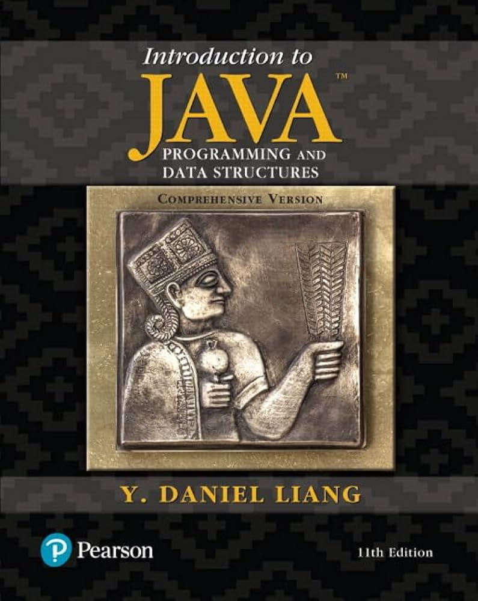

# Java Basic

This part is mainly the about the Java Basic Knowledge from Y. Daniel Liang's _Intro to Java Programming and Data Structures._

<figure><figcaption></figcaption></figure>

## Chapter 1

#### 1.1 - 1.5

This part is too easy so there is not so much to mention.

#### 1.6

1. The **Java language specification** is a technical definition of the Java programming language's syntax and semantics.
2. The **application program interface (API)**, also known as _library_, contains predefined classes and interfaces for developing Java programs.The API is still expanding.
3. Java SE, Java EE and ME
   * _Java Standard Edition_ a.k.a Java SE.
   * _Java Enterprise Edition_ a.k.a Java EE.
   * _Java Micro Edition_ a.k.a Java ME.
4. The **Java Development Kit (JDK)**, consists of a set of separate **programs**, each invoked from a command line, for **compiling, running and testing Java programs**.
   * The **program for running Java programs** is known as **JRE (Java Runtime Environment)**. Instead of using JDK directly, you can use some other development tools (Eclipse etc) that provide an _integrated development environment (IDE)_.
   * In this book, we will use Java SE 8. And Oracle releases each version of Java SE with a _JDK_. For Java SE 8, the JDK is called _JDK 1.8_ (a.k.a _Java 8_ or _JDK 8_).

#### 1.7

As the name suggests (a simple java program), it's very simple. No need to write anything.

#### 1.8

_You save a Java programin in a .java file and compile it into a .class file. The .class file is executed by the Java Virtual Machine (JVM)_

1. `javac Source.java`\
   In this step, your source code will be compiled into the java bytecode file with a `.class` extension. This java bytecode is a low-level language and it is similar to machine instructions but is architecture neutral and can run on any platform that has a _Java Virtual Machine (JVM)_.
2. `java Source.class`\
   Now, you may use the JVM, which is an **interpreter** to execute the bytecode.

#### 1.9 - 1.12

Nothing important.

## Chapter 2

1. The plus sign `+` can also be a _string concatenation operator_. e.g.


```java
System.out.println("1 + 1 = " + 2);
```


2. To read in Java, we can use


```java
import java.util.Scanner;

// ...
Scanner input = new Scanner (System.in);
double radius = input.nextDouble();
```



Note that `.nextDouble()` method can be changed to other types, like `.nextInt()`.


3\. To name a constant in Java, we can use the keyword `final`


```java
//...
final double PI = 3.14159;
```



Note that a constant must be declared and initialized in **the same statement.**


## Chapter 3

1. In Java, there is a `boolean` datatype and the boolean variable can be either `true` or `false`. **You cannot regard nonzero value as true and zero as false as you do in C**!


```java
boolean lightsOn = true;
```


2. In Java, we also have _dangling `else` ambiguity_ problem, which is very similar to C. That is the `else` clause will always match **the most recent unmatched `if` clause** in the same block.


```java
//...
int i = 1, j = 2, k = 3;

if (i > j)
    if (i > k)
        System.out.println("A");
else
    System.out.println("B");
```


This code snippet is equivalent the code below:


```java
// ...
int i = 1, j = 2, k = 3;
if (i > j)
    if (i > k)
        System.out.println("A");
    else
        System.out.println("B");
```


3. In Java, we must also pay attention to the **equality test of two floating-point values**. For example,


```java
// ...
double x = 1 - 0.1 - 0.1 - 0.1 - 0.1 - 0.1;
System.out.println(x == 0.5);
```


In this code snippet, the final output is `false` since x actually is `0.50000001`. To avoid this problem, we can set $$\lvert x - y\rvert < \epsilon$$, where $$\epsilon$$ is a very small value, to test that whehter x is approximate to 0.5 or not.

## Chapter 4

1. The `Math` class is very useful. To use that class, you don't need to import. Just use `Math.method_name()` to invoke the method you want to use.
2. In Java, character is always enclosed in single quotation marks `' '`. And string is always enclosed in double quotation marks `" "`. And a char in Java takes **2 bytes**.
3. The `Character` class is also very useful, it contains some functions help you decide whether a character is uppercase or lowercase etc, which is a bit similar to `ctype.h` in C.
4. In Java, there is a data type called `String` so that you can define the string as follows


```java
String message = "Welcome to Java";
```



The string methods can only be invoked from a specific string instance. For example



```java
message.length();
```


5. In Java, `' '`, `\t`, `\f`, `\r` and `\n` are called **whitespace characters**.
6. To read a string from console, we can use either `.next()` or `.nextLine()`. The difference is that `.next()` will read individual elements seperated by **whitespace characters** while the `.nextLine()` read elements seperated by an entire line only.

## Chapter 5

Loops in Java are totally the same with C. Nothing to record.

## Chapter 6

1. The meaning and use of method in Java is similar to the use of function in C.
2. A "Call Stack", a.k.a _execution stack_, _runtime stack_ or _machine stack_, is often shortened to just "the stack".
3. In Java, the **overloading methods** enables you to define the methods with the same name as long as their parameter lists are different. For example,


```java
// Method 1
public static int max(int num1, int num2) {
    // ...
}
// Method 2
public static int max(double num1, double numb2) {
    // ...
}
// Method 3
public static int max(double num1, double num2, double num3) {
    // ...
}
```


Due to this property, the compiler will find the method that best matches a method invocation. But the _ambiguous invocation_ may also appear and the compiler will output a compile error if encounters the ambiguous invocation.

## Chapter 7

#### Create an array in Java

1. Create the array _reference variable_. This is similar to creating a pointer in C.


```java
// Usage
elementType[] arrayRefVar;
// Example
double[] myList;
```



Note that when defining the reference variable, there is no need to specify the length of the array.


2. Create the _array_. This is similar to allocate memory and then store the starting address of that memory in the pointer variable in C.


```java
// Usage
arrayRefVar = new elementType[arraySize];
// Example
myList = new double[10];
```


3. We can also combine the step 1 and step 2 together


```java
// Usage
elementType[] arrayRefVar = new elementType[arraySize];
// Example
double[] myList = new double[10];
// Using Initializer
double[] myList2 = {1.0, 2.0, 3.0};
```



**Things to Note**:

1. When you create an array, the array elements are automatically initialized to zero for numeric types, false for boolean types.
2. The Initializer must be used in one line.


#### **Foreach Loops**

Java supports a convenient way to iterate through the elements of an array. This is known as the _enhanced for loop_ or the _foreach loop_. For example,


```java
// Usage
for (elementType element: arrayRefVar) {
    // ...
}
// Example
for (double e: myList) {
    System.out.println(e);
}
```


The `e` is the variable that will be assigned to each element of the array in each iteration.

#### Variable-Length Array (VLA)

In Java, the array supports **variable-length**, which means the following is valid.


```java
Scanner input = new Scanner();
int n = input.nextInt();
double[] numbers = new double[n];
```


#### Pass by Reference

In Java, when passing an array to a method, the **reference** of the array is passed to the method. For example:


```java
// Define the method
public static void printArray(int[] array) {
    for (int i = 0; i < array.length; i++) {
        System.out.print(array[i] + " ");
    }
}
// Call the method
printArray(new int[]{1, 2, 3, 4, 5});
```


In this example, we pass an **anonymous array** to the method `printArray()`.

#### `java.util.Array` Library

In Java, the `java.util.Array` class contains many useful methods, likeing sorting and searching.

#### Command-line arguments

In Java, when you pass command-line arguments, these arguements are stored at the String array called `args` and you can use `args[index]` to access each argument and the index starts from 0.

## Chapter 8

#### Create and Initialize a 2-D array

To create a two-dimensional array using an array initializer, we can use the syntax below


```java
elementType[][] arrayVar = {{row values}, ..., {row values}};
```


## Chapter 9

#### 9.2 Defining Classes for Objects

1. In Object-oriented programming (OOP), an _object_ represents an entity in the real world that can be distinctly identified.
2. An object hsa a unique identity, state, and behavior.
   * **Identity**: The **name** of the object
   * **State**: It's often represented by **data fields**. For example, a circle object has a data field `radius`.
   * **Behavior**: The **methods** of the object. For example, a circle object has methods `getArea()` and `getPerimeter()`.
3. Objects of **the same type** are defined using a **common** class. An object is an **instance** of a class. A class is also a data type. You can use it to declare object _reference variables_.
4. A `Circle` class example


```java
class Circle {
    /*****************
    *** data fields ***
    ******************/

    /** The radius of this circle **/
    double radius = 1;

    /******************
    *** Constructors ***
    *******************/

    /** Consturct a circle object **/
    Circle() {
    }

    /** Construct a circle object **/
    Circle(double newRadius) {
        radius = newRadius;
    }

    /*************
    *** Methods ***
    **************/

    /** Return the area of this circle **/
    double getArea() {
        return radius * radius * Math.PI;
    }

    /** Return the perimeter of this circle **/
    double getPerimeter() {
        return 2 * radius * Math.PI;
    }

    /** Set a new radius for this circle **/
    void setRadius(double newRadius) {
        radius = newRadius;
    }
}
```


#### 9.3

1. Only **one** class in the file can be a **public** class. Furthermore, the public class must have the **same name** as the file.

#### 9.4 Constructing Objects Using Constructors

1. Constructors have three peculiarities:
   * A constructor must have the **same** name as the class itself.
   * Constructors **do not** have a return type -- not even `void`.
   * Constructors are invoked using the `new` operator when an object is created. Constructors play the role of initializing objects.
2. A class may be defined without constructors. In this case, a public no-arg constructor with an empty body is **implicitly defined** in the class.

#### 9.5 Accessing Objects via Reference Variables

1. In this code,


```java
Circle myCircle = new Circle();
```



`Circle` is a **reference type**. `myCircle` is an object reference variable which can hold the reference to a `Circle` object. `new Circle()` creates an object and assigns its reference to `myCircle`.


2. In the class `Circle`, the data field `radius` is referred to as an _instance variable_ because it is **dependent on a specific instance**. For the same reason, the method `getArea` is referred to as an _instance method_ because you can invoke it only on a specific instance.
   * Note that we can use `Math.methodName(arguments)` to invoke a method in the `Math` class because these methods are **static methods**. But we cannot do the same on our `Circle` class.
3. The difference between variables of **Primitive Types** and **Reference Types**
   * For a variable of a primitive type, the value is of the primitive type.
   * For a variable of a reference type, the value is **a reference to where an object is located**.
   * In Java, the objects that are no longer useful are called **garbage**, and will be collected automatically by the Java Runtime system.

#### 9.6 Using Classes from the Java Library

1. In the UML diagram, the **class name** is placed at the top, the **data field** in the middle, and the **methods** at the bottom.

#### 9.7 Static Variables, Constants, and Methods

1. In UML diagram, **static variables and methods** are underlined.
2. **Instance Variables** belong to instances and have memory storage independent of one another. **Static variables** are shared by **all the instances of the same class**.
3. To define a **static vairable or method**, we usually add the keyword `static` at the front,


```java
static int numberOfObjects;

static int getNumberObjects() {
    return numberOfObjects;
}
```


4. **Constants** in a class are shared by all objects of the class. Thus, constants should be declared as `final static`.


```java
final static double PI = 3.14159;
```


5. **Instance variables and methods** are accessed via a reference variable (or basically an initialized object). **Static variables and methods** can be accessed from a reference variable or from their class name.
   * However, it is **recommended** to use `ClassName.staticMethod()` to invoke a static method and `ClassName.staticVariable` to access a static variable. This **improves readability** because this makes static methods and data easy to spot.
6. **Instance method**:
   * **Can** access **instance variables** and invoke **instance methods** directly.
   * **Can** access **static variables** and invoke **static methods** directly.
7. **Static method**:
   * **Can** access **static variables** and invoke **static methods** directly.
   * **Cannot** access **instance variables** or invoke **instance methods** directly.
   * However, a static method can access an instance variable or invoke an instance method through an **object reference**.
8. Design Guide (To decide whether a variable or a method should be instance or static)
   * A variable or method that is **dependent on a specific instance of the class** should be an **instance variable or method**.
   * A variable or method that is **not dependent on a specific instance of the class** should be a **static variable or method**.

#### 9.8 Visibility Modifiers

1. **A visibility modifier (`public`, `private` ...)** specifies how **data fields and methods** in a class can be accessed **from outside the class**. There is **no restriction** on accessing data fields and methods **inside the class**.
   * **private**: The private modifier restricts access to its **defining class**, which makes methods and data fields accessible **only from within its own class**.
   * **default**: If you didn't specify `public` or `private`, it should be the **default modifier**. It restricts access to the **package**.
   * **public**: The public modifier enables **unrestricted access**, which means the method or data field can be accessed **from any other classes**.

#### 9.9 Data Field Encapsulation

1. To declare **data fields** as **private** using `private` modifier is known as **data field encapsulation**. After that, we should provide a _getter_ method or _accessor_ to return its value and a _setter_ method or _mutator_ to set its value. These two methods must be `public`.
   * From now on, **all data fields** should be declared **private**, and **all constructors and methods** should be defined **public**, unless specified otherwise.

#### 9.10 Pass Objects to Methods

1. Passing an object is actually passing the **reference** of the object (which basically is the location of the object in the heap).
2. Java uses exactly one mode of passing arguments: _pass-by-value_. When an object is passed to a method, this value passed is a **reference** to a object.
3. **Objects** are stored in a **heap**. But the variable to store the **reference** is in the **stack**.

#### 9.11 Array of Objects

1. An array of objects is an array of **reference variables**.
   *   When an array of objects is created using the `new` operator,

       
       ```java
       Circle[] circleArray = new Circle[10];
       ```
       

       each element in the array is a reference variable with a default value of `null`. We need to use another loop to create objects for each element in the array using `new` operator.

       
       ```java
       for (int i = 0; i < circleArray.length; i++) {
           circleArray[i] = new Circle();
       }
       ```
       

#### 9.12 Immutable Objects and Classes

1. For a class to be **immutable**, it must meet the following requirements:
   * **All data fields** are **private**.
   * There **can't** be any **mutator methods** for data fields
   * **No accessor methods** can return a reference to a data field that is mutable (which means an object can be in the data field).

#### 9.13 The Scope of Variables

1. **Instance and static variables** in a class are referred to as the **class's variables** or **data fields**. A variable **defined inside a method** is referred to as a **local variable**.
   * The scope of a class's variable is the **entire class**, regardless of where the variables are declared.
   * If a local variable has the same name as a class's variable, the local variable **takes precedence** and the class's variable with the same name is **hidden**.

#### 9.14 The `this` Reference

1. The `this` keyword refers to the **object itself**.
   *   Using `this` to Reference Data Fields,

       
       ```java
       private double radius;

       public void setRadius(double radius) {
           this.radius = radius;
       }
       ```
       

       In this code snippet, `this.radius` just refers to the radius in the data field. If you use the following,

       
       ```java
       private double radius;

       public void setRadius(double radius) {
           radius = radius;
       }
       ```
       

       The first `radius` is the parameter since it has higher precedence than the class variable (data field radius). This will be **wrong**. To summarize, `this` keyword gives us a way to **reference the object that invokes an instance method**.
   *   Using `this` to Invoke a Constructor The `this` keyword can be used to invoke another constructor of the same class.

       
       ```java
       public class Circle {
           private double radius;
           public Circle(double radius) {
               this.radius = radius;
           }
           public Circle() {
               this(1.0);
           }
       }
       ```
       

       In this code snippet, `this(1.0)` will invoke the first constructor with a `double` argument.

       * Note that java requires that `this(arg-list)` statement appear first in the constructor before any other executable statements.
       * Using `this(arg-list)` can make a constructor with **no or fewer arguments** invoke a constructor with **more arguments**, which can simplify coding and make the class easier to read and to maintain.
