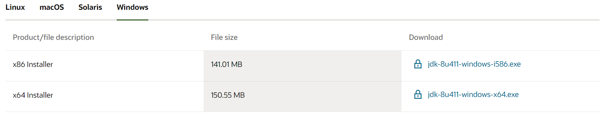
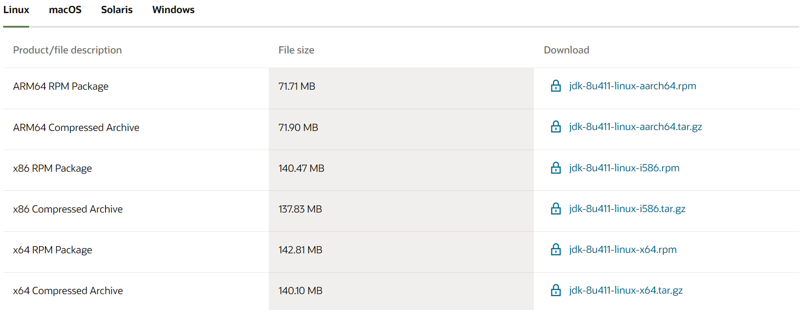
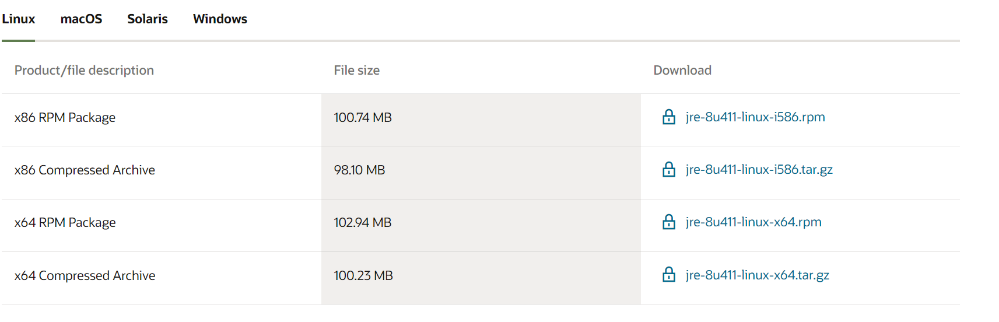

# Setup

## Windows

### Install JDK and JRE

1. Download the corresponding installer from [oracle](https://www.oracle.com/java/technologies/downloads/#java8-windows).

<figure><figcaption></figcaption></figure>

2. Execute Installer to install. Quite easy. Note that the installer will install both the JDK and the corresponding JRE.

### Set Path

1. Update the environment variables `PATH`. For me I just need to add `C:\Program Files\Java\jdk-1.8\bin` to my User variable.

## Ubuntu

### Install JDK and JRE

#### JDK

1. Download the corresponding file from [oracle](https://www.oracle.com/java/technologies/downloads/#java8-linux). For Ubuntu users, please download the "Compressed Archive" File.

<figure><figcaption></figcaption></figure>

2. Uncompress the `.tar.gz` using command `tar zxvf your-name.tar.gz`. Then move all the file to a new installation directory if you like. For me, it's `/usr/lib/jvm/jdk-1.8-oracle-x64`.

#### JRE

1. Download the corresponding "Compressed Archive" file from [oracle](https://www.oracle.com/java/technologies/downloads/#java8-linux).

<figure><figcaption></figcaption></figure>

2. Uncompress the file and move it to the installation directory. For me it's `/usr/lib/jvm/jre-1.8-oracle-x64`


Note that `x64` can be replaced to your architecture.


### Set Path

1.  Add this line to your `~/.bashrc` (Note to change the directory to yours) \\

    ```bash
    export PATH=/usr/lib/jvm/JDK-directory/bin:$PATH
    ```
2. Reload using `source ~/.bashrc`

## References

1. [https://docs.oracle.com/javase/8/docs/technotes/guides/install/install\_overview.html#A1097144](https://docs.oracle.com/javase/8/docs/technotes/guides/install/install_overview.html#A1097144)
2. [https://docs.oracle.com/cd/E19215-01/820-2215/6ndr6ai1m/index.html](https://docs.oracle.com/cd/E19215-01/820-2215/6ndr6ai1m/index.html)
3. [https://media.pearsoncmg.com/ph/esm/ecs\_liang\_ijp\_11/cw/content/supplements/Supplement1bInstallingJDK8.pdf](https://media.pearsoncmg.com/ph/esm/ecs_liang_ijp_11/cw/content/supplements/Supplement1bInstallingJDK8.pdf)
