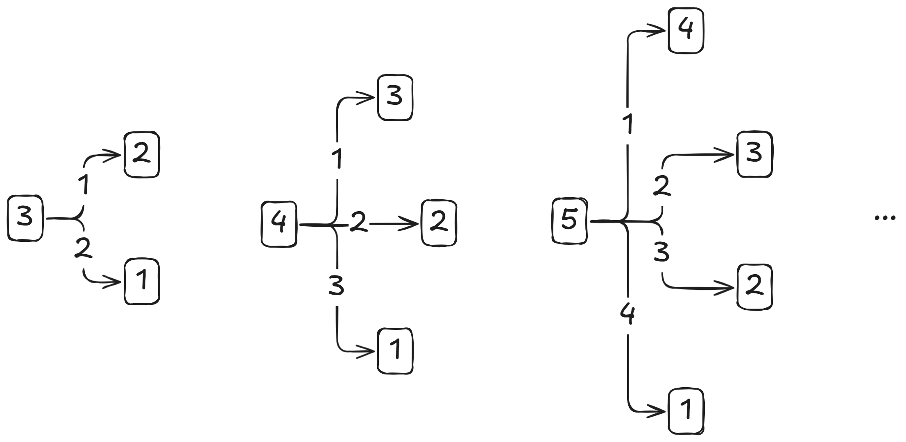

# Breaking Branches\*

## Question



## Solution

### Idea

This is a pretty awesome problem! At first, I thought it was a **recursion** problem, but can be optimized by **dynamic programming**. But after some searching, I found it is **brain teaser** a.k.a **pattern recognition** (legit) :joy:. And it needs some thinking to come up with the $$O(1)$$ solution.

Firstly, for a certain length of branch, the winning status will invert. For example, with length 2, if it's Alice's turn, Alice will win. However, if it's Bob's turn, Alice will lose (a.k.a Bob will win).

With this information, we can start finding the pattern.

#### Method 1: Mathematical Induction

<figure><picture><source srcset="../../.gitbook/assets/kattis-breakingbranches-dark.png" media="(prefers-color-scheme: dark)"></picture><figcaption></figcaption></figure>

In this example diagram, we can find the following patterns

1. With every length, we only need to stop at the "half" point because you will notice that the lower half will be the same as the upper half.
2. When the length is an **even** number, Alice confirm will win and the winning move is 1. Otherwise, if the length is an **odd** number, Bob confirm will win. This is not easy to figure out right, let's analyse the two examples when the length is 4 and 5.
   1. Length is 4. At first try, Alice cut 1, left 3 for Bob. From the previous turn, we already know that if length is 3 and it's Alice's turn, Alice will lose. But it's Bob's turn now, so we can invert the result, so **Alice will win**.
   2.  Length is 5. At first try, use the similar analysis above, we know that Alice will lose. At the second try, after Alice cut 2, we have two options left, 2 and 3.

       1. If Bob chooses 2, then Bob will win, [meaning it will be Alice's turn](#user-content-fn-1)[^1] to start cutting the remaining 3 and we already know that **Alice will lose**.
       2. If Bob chooses 3, then Bob will lose, [meaning it will still be Bob's turn](#user-content-fn-2)[^2] to start cutting the remaining 2 and we already know that **Bob will win**.

       And given that we can start at the "half" point, we can now conclude that Alice confirm will lose at length 5.


The formal proof for the pattern 2 needs [mathematical induction](https://app.gitbook.com/s/KipySCGxC8NC1UpA24DS/lec-tut-lab-exes/lab/lab-02#mathematical-induction).


#### Method 2: The idea of `total_cuts`

Using the idea of `total_cuts` from [chocolate-division.md](chocolate-division.md "mention"), the question is similar. For a given length `l` branch, we have `l-1` number of available cuts in total. So, now the pattern is easy to understand:

1. If `total_cuts` is odd, Alice will confirm win with first step cutting by 1.
2. Otherwise, Bob will win.

### Code



[^1]: Why? "Bob wins at length 2" means that after Bob made the last cut, Alice had nothing to cut. So, Alice will start to cutting the remaining length.

[^2]: Why? This is because "Bob will lose with length 3" means after Alice made the last cut, Bob has nothing to cut. So, Bob will start the new turn.
