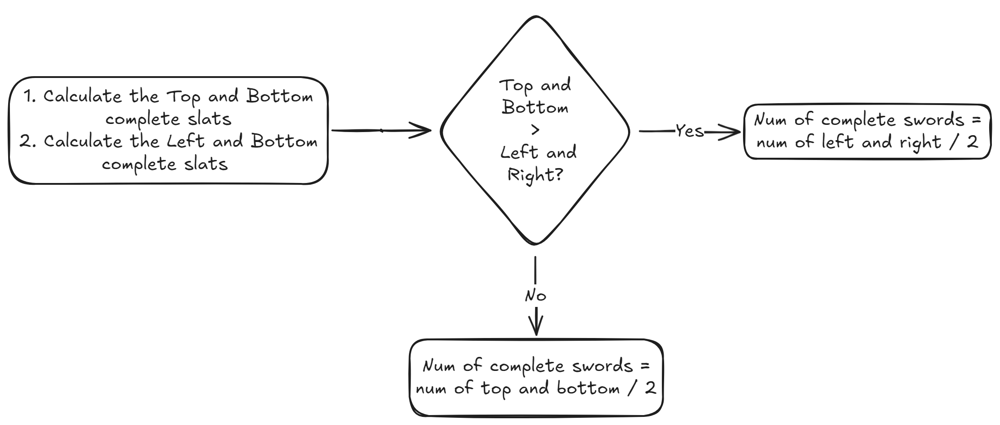

# Broken Swords

## Question



## Solution

### Idea

This question seems to be an algorithm question, but instead it is a **maths** problem! The flowchart is shown as follows:

<figure><picture><source srcset="../../.gitbook/assets/kattis-brokenswords-dark.png" media="(prefers-color-scheme: dark)"></picture><figcaption></figcaption></figure>

The part of code related is shown as follows:


```c
long num_top_bot = calc_t_b_avai(n, words);
long num_lef_rig = calc_l_r_avai(n, words);
long num_complete = (num_top_bot >= num_lef_rig) ? (num_lef_rig / 2) : (num_top_bot / 2);
long left_top_bot = num_top_bot - num_complete * 2;
long left_lef_rig = num_lef_rig - num_complete * 2;
```


### Code


